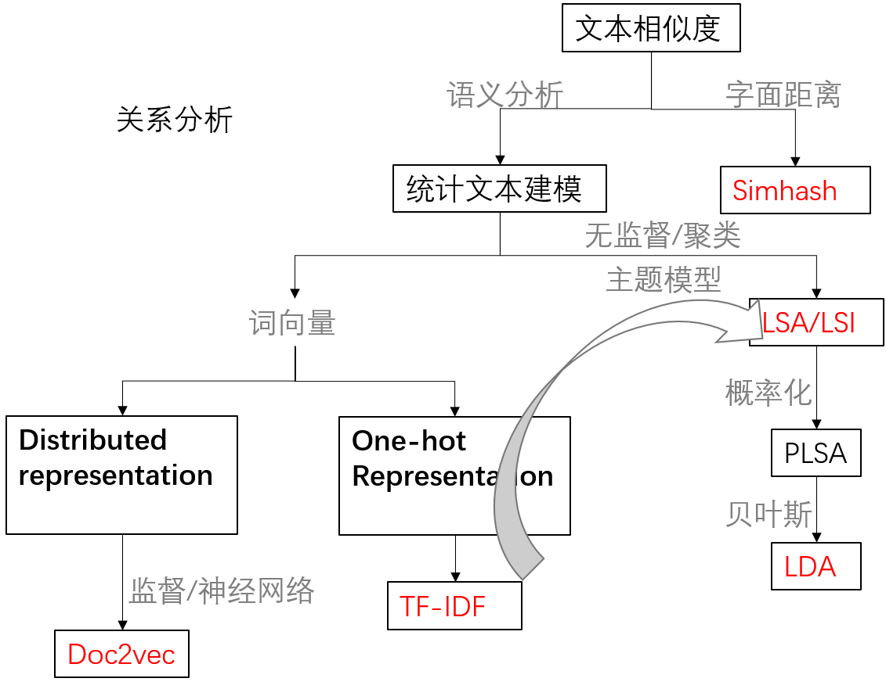

# 文本相似度分析

张晶尧

---

---

## 如何度量两个文本之间的相似性

文本->抽象分解->数学角度量化

文本是一种高维的语义空间。而衡量两个字符串的相似性有很多种方法.
+ 字面距离（hashcode）
+ 语义分析（词向量tf-idf，主题模型lsa/lsi, lda）

---
## 字面距离

比较两个字符串中每一个字符是否相等,
或者将每一个字符串通过哈希函数映射为一个哈希值进行比较。

缺点就是对于相似性的度量其只有两种，0不相似，1相似。

---
### 莱文斯坦距离(编辑距离)

指两个字串之间，由一个转成另一个所需的最少编辑操作次数。
许可的编辑操作包括将替换，插入，删除**一个**字符。

### jaro距离

# 

+ m是匹配数目（保证顺序相同）
+ |s|字符串长度
+ t是换位数目
---
### simhash

一种局部敏感hash，它也是Google公司进行海量网页去重使用的主要算法。

传统的Hash算法只负责将原始内容尽量**均匀随机地映射为一个签名值**，原理上仅相当于伪随机数产生算法。如果两个hash值不相等，除了说明原始内容不相等外，不再提供任何信息，因为即使原始内容只相差一个字节，所产生的签名也很可能差别很大。

SimHash本身属于一种局部敏感哈希算法，它产生的hash签名在一定程度上可以表征原内容的相似度。

---
### simhash过程

+ 分词：单词序列并为每个词加上权重。
  “51区（5）雇员（3）称（1）内部（2）有（1）飞碟（5）”
  
+ hash：通过hash算法把每个词变成hash值。
  “51区”通过hash算法计算为 101011。
  
+ 加权，需要按照单词的权重形成加权数字串。
  “51区”的hash值为“101011”，通过加权计算为 “ 5 -5 5 -5 5 5”。
  
+ 合并：各个单词算出来的序列值累加，变成只有一个序列串。
  “美国”的 “4 -4 -4 4 -4 4”，“51区”的“5 -5 5 -5 5 5”，累加得到“9 -9 1 -1 1 9”。
  
+ 降维：把“9 -9 1 -1 1 9” 变成01串，形成最终的simhash签名。
 大于0记为1，小于0记为0。最后算出结果为：“1 0 1 0 1 1”。
 
---
### simhash过程

# 
---
### simhash 计算相似性

两个等长字符串之间的汉明距离（Hamming distance）
是两个字符串对应位置的不同字符的个数。

如：1011101与1001001之间的汉明距离是2

一般在利用simhash进行文本相似度比较时，我们认为汉明距离小于3的文本是相似的。

---

## 语义相似性

有时直接通过字面距离无法比较，如：中国-北京，意大利-罗马。

涉及语义分析，首先需要找到一种方法把自然语言的符号数学化。

有两大理论方向：
+ 一种是基于统计的经验主义方法
+ 一种是基于规则的理性主义方法

---
### 统计文本建模-Bow和TF-IDF

词袋模型：Bag-of-words model

词频TF： $TF=\frac{count(w,d)}{size(d)}$
    
	count(w,d):词w在文档d中出现次数
	size(d):总词数

逆向文件频率IDF：$log\frac{n}{docs(w,D)}$
    
	n:文件总数目
	docs(w,D)}:包含该词语的文件数目

TFIDF算法假设区别文档最有意义的词语应该是那些
在文档中出现频率高，而在整个文档集合的其他文档中出现频率少的词语。

---
### LSI/LSA

1.将文档库表示成VSM模型的词-文档矩阵Am×n矩阵

	列向量表示一个词在不同文档出现的次数
	行向量表示的是不同的文档.
	A = [αij],在此矩阵中 ,αij为非负值，
        表示第j个词在第i个文档中出现的频度或者TF-IDF值。

2.利用奇异值分解SVD，求A的只有K个正交因子的降秩矩阵，该过程就是降维的过程。

	K的取值对整个分类结果的影响很大。
	K过小，则丢失信息就越多；
	K过大，信息虽然多，但可能有冗余且计算消耗大。
	一般取值为100-300，不绝对。

3.计算余弦相似度
$$\cos\theta=\frac{\sum_{i=1}^{n}{(A_i*B_i)}}{\sqrt{\sum_{i=1}^n{(Ai^2)}}*\sqrt{\sum_{i=1}^n{(Bi^2)}}}=\frac{{A}\cdot{B}}{|A|*|B|}$$

---

### 统计文本建模-用概率学猜测上帝投骰子

	最简单的无序模型:词之间，文档之间独立可交换
    
+ 一个骰子有V面，一面对应一个单词，概率不同，记$\vec{p}=\{p_1,p_2...p_V\}$
+ 一篇文档有n个词，独立抛了n次骰子，每个词服从多项分布。

	贝叶斯无序模型
    
+ 无穷个骰子，每一个有V面，骰子服从分布p($\vec{p}$)即是先验分布。
+ 上帝抽了一个骰子，用这一个不断抛，生成所有词。

---

	PLSA模型-1999年Hoffmn
    
+ 有两种骰子，doc-topic有K面和topic-word有V面。
+ 先有一个doc-topic骰子，投掷得到topic编号，投掷编号z的骰子得到单词

	LDA模型
    
+ 有两种骰子，doc-topic有K面和topic-word有V面。
+ 先有一个doc-topic骰子，投掷得到topic编号，投掷编号z的骰子得到单词
+ 两种骰子都是参数，都要有先验分布。

